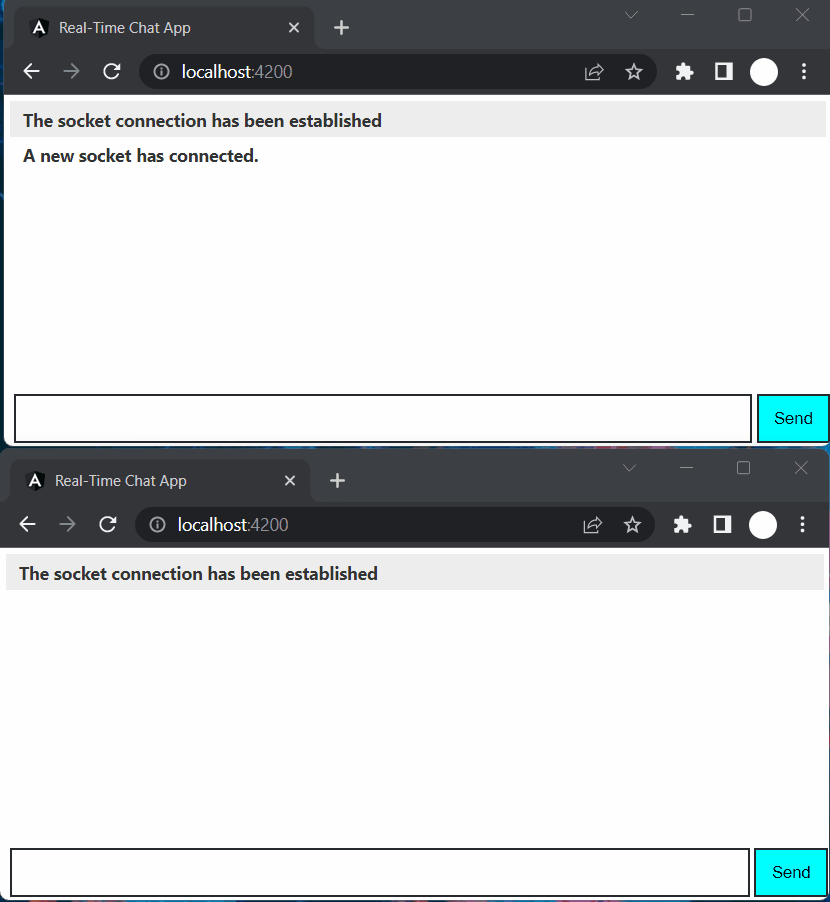

# Real-time Chat App



This GitHub repository contains the source code for a real-time chat application built using Go for the backend and Angular for the frontend. The application allows users to chat with each other in real-time, with messages displayed instantly as they are sent. 

The backend of the application is built using Go, a powerful programming language known for its speed and efficiency. It uses the Gorilla WebSocket package to handle real-time communication between clients and the server.

The frontend of the application is built using Angular, a popular front-end development framework that provides powerful tools for building responsive and dynamic user interfaces. It uses Socket.IO to handle real-time communication with the server and display chat messages to the user.

Overall, this repository provides a solid foundation for building a real-time chat application using Go and Angular, and is a great resource for developers looking to learn more about building real-time applications using these powerful technologies.

Technology used : Go, Angular

## Run Locally

Clone the project

```bash
  git clone https://github.com/bagasdisini/real-time-chat-app
```

Go to the project directory

```bash
  cd real-time-chat-app
```

### Back End Setting

Install dependencies

```bash
  cd backend
  go mod tidy
```

Start the server

```bash
  go run .
```
### Front End Setting

Install dependencies

```bash
  cd frontend
  npm install
```

Start the server

```bash
  npm start
```
